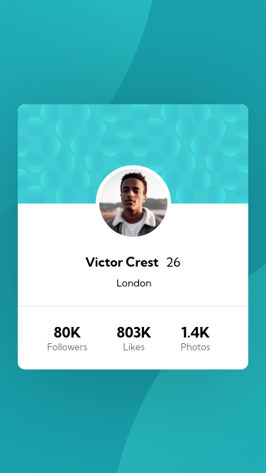
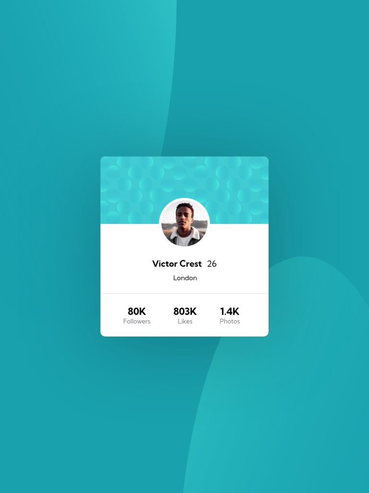
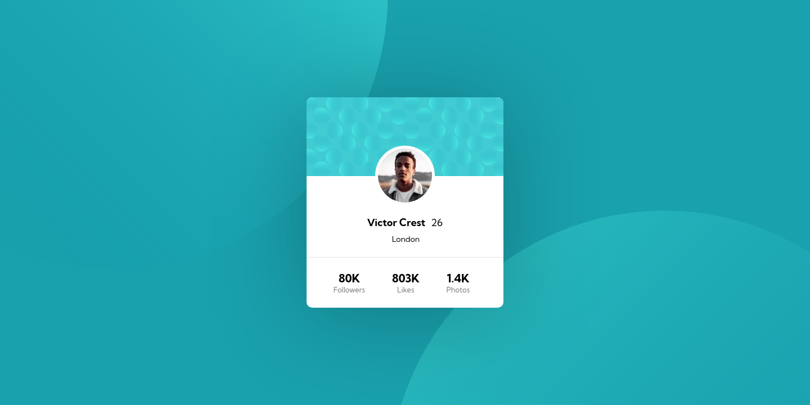

# Frontend Mentor - Profile card component solution

This is a solution to the [Profile card component challenge on Frontend Mentor](https://www.frontendmentor.io/challenges/profile-card-component-cfArpWshJ). Frontend Mentor challenges help you improve your coding skills by building realistic projects.

## Table of contents

- [Overview](#overview)
  - [The challenge](#the-challenge)
  - [Screenshot](#screenshot)
  - [Links](#links)
- [My process](#my-process)
  - [Built with](#built-with)
  - [What I learned](#what-i-learned)
  - [Useful resources](#useful-resources)
- [Author](#author)

## Overview

This is the front-end mentor's third challenge. The challenge is to build this component of the 3-column preview card component solution and make it as close to the design as possible. Building the desing with whatever you want to finish, any language, framework or tools.

### The challenge

Users should be able to:

- View the optimal layout depending on their device's screen size

## Screenshot

### Mobile design

<p  align="center">
  </img>
</p>

### Tablets design

<p  align="center"></img></p>

### Desktop design

<p  align="center"></img></p>

### result of my work

<p  align="center"></img></p>

### Links

- Solution URL: [My solution for this challenge](https://www.frontendmentor.io/solutions/3column-with-react-3BdTaZ_bd)
- Live Site URL: [check the result ](https://jdcm-3-column.netlify.app)

## My process

### Built with

- Flexbox
- [React](https://reactjs.org/) - JS library

### What I learned (arrumar)

Sometimes keep measurements fixed and not just based on percentages. When all measurements are based on percentages, unwanted behaviors can occur that will cause you to get lost in the styling.
By using only percentages I found errors in my responsive design, and when I established fixed heights for content and cards, the design was much better suited to responsiveness, with only the width behaving as adaptable, while the cards had defined sizes.

```CSS
  @media (max-width: 928px) {
  .conteiner {
    width: 100%;
    height: 100vh;
    overflow: auto;
    display: flex;
    justify-content: center;
    align-items: inherit; /**/
  }

  .content {
    width: 87.2%;

    height: 132.6rem;
    background: white;
    margin: 88px 0 88px 0;

    display: inline; /*  */
  }
}

```

### Useful resources

- [react tutorial](https://pt-br.reactjs.org/tutorial/tutorial.html) - This helped me structure the components and build the proposed page.
- [my figma design](https://www.figma.com/file/IY4faSy5LPomrLSln321Ag/bottom?node-id=0%3A1) - My figma design for help anyone who wants to build this challenge.
- [CSS units](https://www.alura.com.br/artigos/guia-de-unidades-no-css) - CSS units guide .
- [text-tranform](https://www.maujor.com/blog/2013/03/08/por-que-height-100-nao-funciona/) - This is an amazing article that finally helped me solve my design liability issue. And I would recommend to anyone who still has this problem to read it.

## Author

- Personal Page - [Jean Carlos De Meira](https://jcdmeira.github.io)
- Frontend Mentor - [@JCDMeira](https://www.frontendmentor.io/profile/JCDMeira)
- Instagram - [@jean.meira10](https://www.instagram.com/jean.meira10/)
- GitHub - [JCDMeira](https://github.com/JCDMeira)
